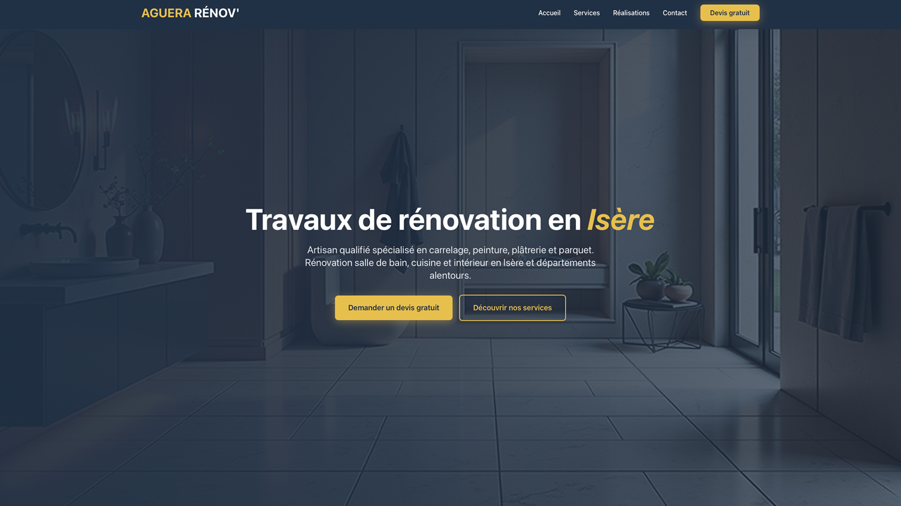
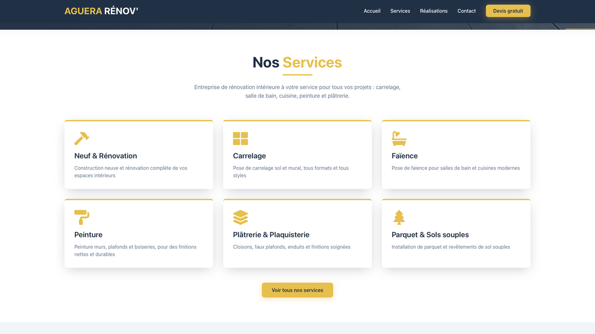
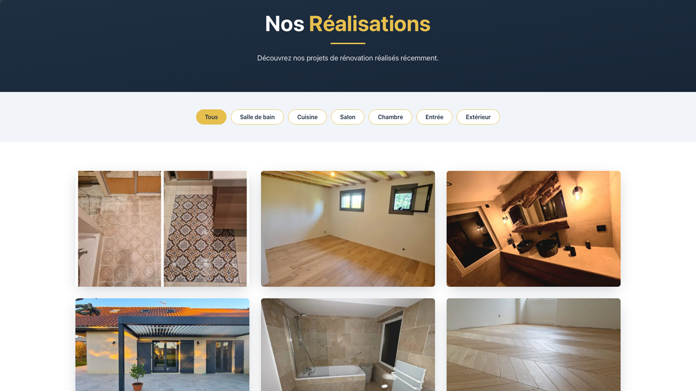
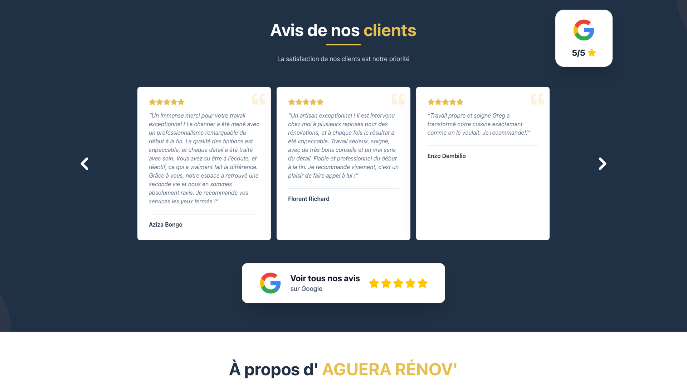
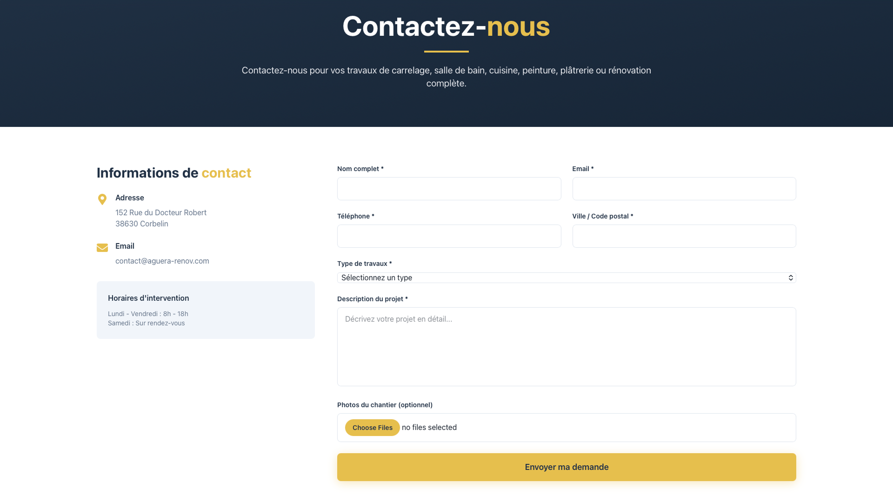

<div align="center">

# 🏗️ AGUERA RENOV

### Professional Renovation Company Website

[]()
[]()
[]()
[]()
[]()

Modern business website built for a French renovation company, combining a polished customer experience, SEO optimization, and dynamic content management.

**🌐 Live Website:** https://www.aguera-renov.fr

</div>

---

## ✨ Overview

AGUERA RENOV is a production-ready website developed for a real renovation company.

The goal was to create a modern digital presence capable of:

- 🏠 Presenting services and expertise
- 📸 Showcasing completed renovation projects
- 📈 Improving online visibility through SEO
- 📩 Generating qualified leads
- 🛠️ Allowing content updates without developer intervention

---

## 🚀 Features

### Public Website

- Fully responsive design
- Modern animations and interactions
- Service presentation pages
- Project gallery and portfolio
- Contact form with email notifications
- SEO-friendly architecture
- Legal and privacy pages
- Sitemap generation

### Content Management

- Headless CMS integration
- Dynamic project management
- Dynamic service management
- Editable business information
- Client-friendly content workflow

---

## 🛠️ Tech Stack

| Category | Technologies |
|----------|-------------|
| Frontend | Next.js 14, React, TypeScript |
| Styling | Tailwind CSS, DaisyUI |
| Animation | Framer Motion |
| CMS | Sanity |
| Email | Resend |
| Deployment | Vercel |

---

## 🏛️ Architecture

```text
Visitor
   │
   ▼
Next.js Frontend
   │
   ├── Sanity CMS
   │      └── Content Management
   │
   └── Resend
          └── Contact Form Emails
```

### Why this architecture?

✅ Excellent SEO

✅ Fast page loading

✅ Easy content updates

✅ Low maintenance

✅ Scalable deployment

---

## 🎯 Highlights

### SEO-Focused Development

- Metadata optimization
- Structured page hierarchy
- Sitemap generation
- Mobile-first approach
- Performance optimization

### Client Autonomy

The website was designed so the business owner can independently:

- Add projects
- Update services
- Edit content
- Manage their online presence

### Real-World Deployment

Unlike tutorial projects, this application is actively used by a real business.

---

## 📷 Screenshots

<div align="center">

| Homepage | Services |
|-----------|-----------|
|  |  |

| Projects | Google Business |
|-----------|-----------|
|  |  |

| Contact |
|-----------|
|  |

</div>

---

## 💻 Local Development

```bash
npm install
npm run dev
```

Open:

```text
http://localhost:3000
```

---

## 🔐 Environment Variables

This public portfolio version does not contain production secrets.

```env
RESEND_API_KEY=

SANITY_PROJECT_ID=
SANITY_DATASET=
SANITY_API_VERSION=
SANITY_READ_TOKEN=

RECIPIENT_EMAIL=
```

---

## 📚 What I Learned

This project helped strengthen my experience with:

- Production-ready Next.js applications
- Headless CMS workflows
- SEO implementation
- Client-facing development
- Responsive design
- Email integrations
- Content modeling
- Deployment and maintenance

---

## ⚠️ Disclaimer

This repository is a portfolio showcase version of a real client project.

Sensitive information, credentials, and client-specific configuration have been removed or sanitized before publication.

---

## 👨‍💻 Author

**Yoann Robert**

Full-Stack Developer & Data Enthusiast

- GitHub: https://github.com/luneroka
- Portfolio: https://yoannrobert.com
- LinkedIn: https://www.linkedin.com/in/robertyoann/

